# 🚀 GORR - Go-RE-Releaser

> *A smart wrapper around GoReleaser that simplifies semantic versioning and release management.*

<div align="center">

[](https://golang.org/)
[](LICENSE)
[](https://goreleaser.com/)

</div>

## ✨ Features

- 🚀 **Smart Release Management**: Automatically handles version bumping (patch, minor, major)
- 🧪 **Snapshot Mode**: Test releases without creating Git tags
- 🔄 **Git Integration**: Automatically pushes changes and creates tags
- 📦 **GoReleaser Compatibility**: Full access to all GoReleaser *free* features
- 🛡️ **Safety Checks**: Validates Git status and version format before release
- 🎯 **Simple Commands**: Intuitive command structure

## 📋 Requirements

- 🐹 **Go 1.21+**
- 📁 **A git repository** 
- 📦 **GoReleaser** installed


## 🛠️ Installation

```bash
go install github.com/GlazKrovi/go-re-releaser@latest
```

## 🎯 Usage

### 🚀 Smart Release Commands

```bash
# Official release (creates Git tag and pushes)
gorr release patch    # v1.0.0 → v1.0.1
gorr release minor    # v1.0.0 → v1.1.0  
gorr release major    # v1.0.0 → v2.0.0

# Test release (no Git tag created)
gorr release patch --snapshot
gorr release minor --snapshot --skip-publish
```

### 🔧 Direct GoReleaser Commands

```bash
# All other commands pass directly to GoReleaser

gorr check    # call goreleaser check
gorr init     # call goreleaser init
gorr build    # call goreleaser build

# ...
```

## ⚙️ How It Works

### 🚀 Release Mode (`gorr release`)

```mermaid
graph TD
    A[🚀 gorr release patch] --> B[🔍 Check Git Status]
    B --> C[✅ Validate Current Version]
    C --> D[📊 Calculate Next Version]
    D --> E[🔄 Push Changes to Remote]
    E --> F[🏷️ Create & Push Git Tag]
    F --> G[📦 Run GoReleaser]
    G --> H[🎉 Release Complete!]
```




## 💡 Examples

```bash
# 🧪 Test a patch release
gorr release patch --snapshot

# 🚀 Create a minor release with custom GoReleaser options
gorr release minor --snapshot --skip-publish --timeout 30m

# 🔧 Use GoReleaser directly
gorr check
gorr build --snapshot
```

## 🏷️ Version Format

GORR expects Git tags in semantic versioning format:

| ✅ Valid | ❌ Invalid |
|----------|------------|
| `v1.0.0` | `1.0.0` |
| `v2.1.3` | `test-tag` |
| `v0.1.0` | `v1.0` |

## 🚨 Error Handling

| Error Type | What Happens |
|------------|--------------|
| 🗂️ **Dirty Git Tree** | Prevents release if uncommitted changes exist |
| 🏷️ **Invalid Version Tag** | Validates tag format before proceeding |
| 📤 **Git Push Failure** | Stops execution if push fails |
| 📦 **GoReleaser Failure** | Displays clear error messages |

## 📄 License

MIT License - see [LICENSE](LICENSE) file for details.

---

<div align="center">

**Made with ❤️ by the GORR team**

[⭐ Star this repo](https://github.com/your-username/go-re-releaser) • [🐛 Report Bug](https://github.com/your-username/go-re-releaser/issues) • [💡 Request Feature](https://github.com/your-username/go-re-releaser/issues)

</div>
